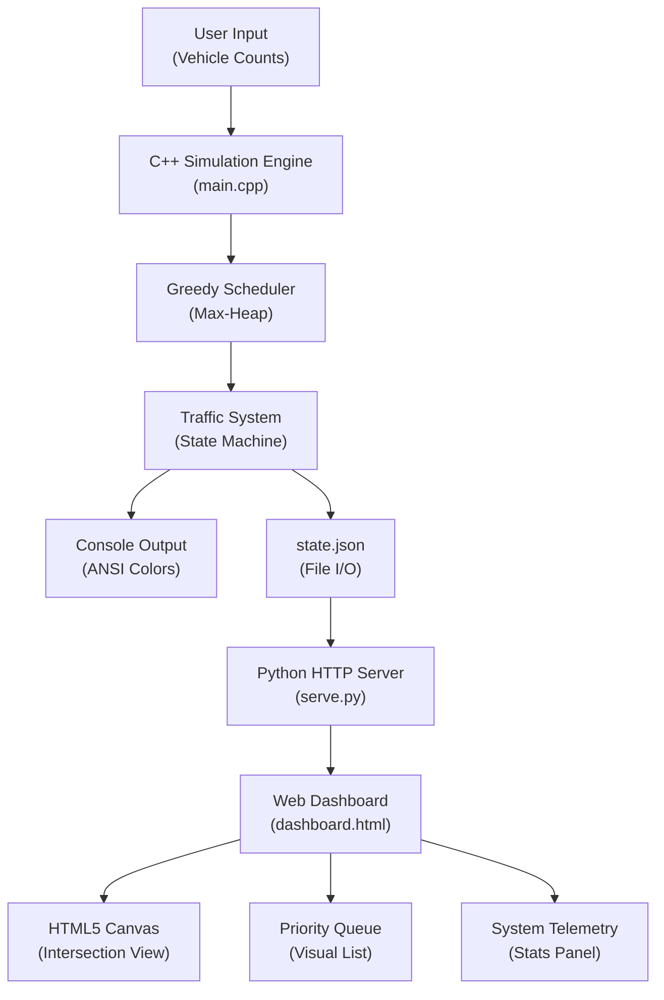
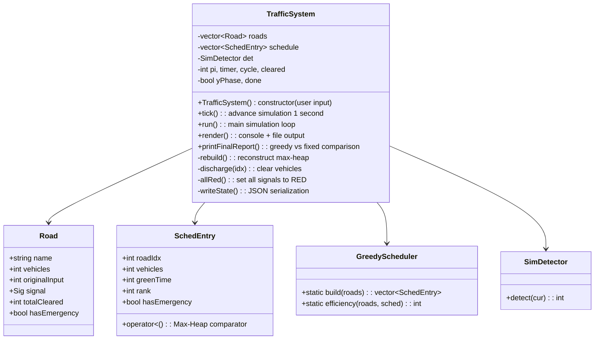
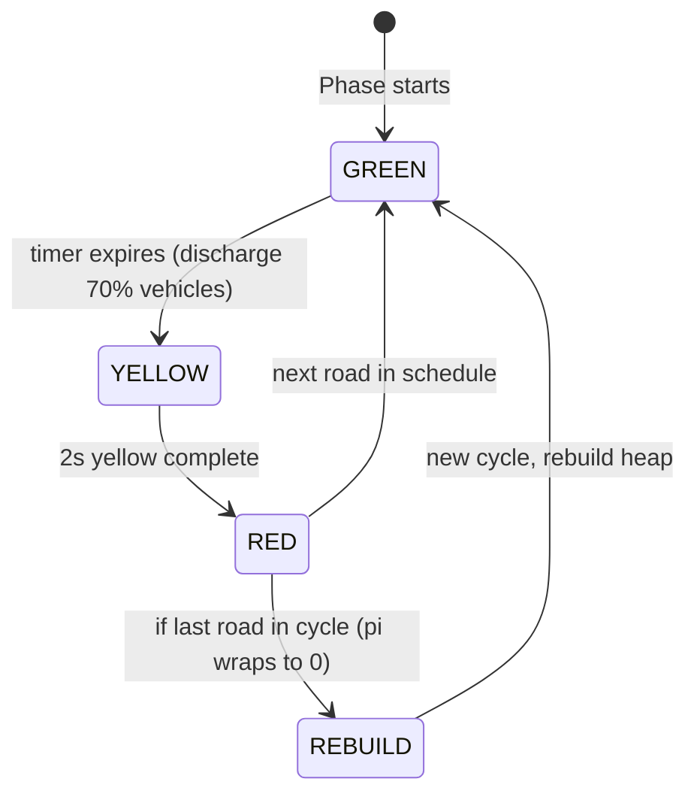

# Dynamic Traffic Signal Optimization System
## DAA Project-Based Learning (PBL) Report

---

| Field | Details |
|---|---|
| **Subject** | Design and Analysis of Algorithms (DAA) |
| **Project Title** | Dynamic Traffic Signal Optimization Using Greedy Scheduling |
| **Technology** | C++, HTML/CSS/JS (Dashboard), Python (HTTP Server) |
| **Core Algorithm** | Greedy Algorithm with Max-Heap (Priority Queue) |
| **Data Structure** | Max-Heap (`std::priority_queue`) |

---

## Table of Contents

1. [Abstract](#1-abstract)
2. [Introduction](#2-introduction)
3. [Literature Survey](#3-literature-survey)
4. [Problem Definition](#4-problem-definition)
5. [Objectives](#5-objectives)
6. [System Architecture & Design](#6-system-architecture--design)
7. [Algorithm Design & Analysis](#7-algorithm-design--analysis)
8. [Implementation Details](#8-implementation-details)
9. [Results & Performance Analysis](#9-results--performance-analysis)
10. [Conclusion](#10-conclusion)
11. [Future Scope](#11-future-scope)
12. [References](#12-references)
13. [Appendix: Source Code](#13-appendix-source-code)

---

## 1. Abstract

Urban traffic congestion is a critical challenge leading to increased commute times, fuel wastage, and elevated pollution levels. Traditional fixed-time traffic signal systems allocate equal green-light durations to all roads regardless of real-time traffic density, leading to significant inefficiencies. This project presents a **Dynamic Traffic Signal Optimization System** that employs a **Greedy Scheduling Algorithm** backed by a **Max-Heap Priority Queue** to dynamically allocate green-light durations proportional to real-time vehicle counts on each road.

The system simulates a 4-way intersection where each road's green time is computed using the formula **T_i = (V_i / V_total) × T_cycle**, clamped within configurable bounds. Roads are ranked using a Max-Heap for O(log n) greedy selection, ensuring the busiest road is always served first. The project also incorporates **emergency vehicle preemption** — ambulances and fire trucks are automatically promoted to the front of the scheduling queue.

A real-time **web-based dashboard** (HTML5 Canvas + JavaScript) provides a visual representation of the intersection, signal states, priority queue, and system telemetry. Performance analysis demonstrates a measurable improvement in vehicles cleared per cycle compared to a fixed-time baseline.

**Keywords:** Greedy Algorithm, Max-Heap, Priority Queue, Traffic Signal Optimization, Real-Time Scheduling, DAA, C++.

---

## 2. Introduction

### 2.1 Background

Traffic management is one of the most pressing urban challenges globally. According to the INRIX Global Traffic Scorecard, the average urban commuter loses over 100 hours annually to traffic congestion. Traditional traffic systems operate on fixed-time cycles — every road gets an equal share of the green-light duration regardless of how many vehicles are actually waiting. This leads to:

- **Wasted green time** on empty or low-traffic roads
- **Excessive wait times** for heavily congested roads
- **No adaptability** to real-time conditions or emergencies

### 2.2 Motivation

The motivation for this project stems from the observation that traffic signal timing is fundamentally a **resource allocation problem** — the resource being "green time" within a fixed cycle, and the competing demands being the vehicles on each road. This maps naturally to algorithmic strategies studied in DAA:

- **Greedy strategy** — always serve the road with the most vehicles first
- **Priority queue (Max-Heap)** — efficiently extract the highest-priority road in O(log n) time
- **Proportional allocation** — distribute green time in proportion to demand

### 2.3 Scope

This project implements a complete traffic signal simulation covering:
- A C++ console-based simulation engine with real-time output
- A greedy scheduling algorithm using a Max-Heap
- Emergency vehicle preemption logic
- A live web dashboard connected via JSON state sharing
- Quantitative comparison between greedy and fixed-time approaches

---

## 3. Literature Survey

| # | Title / Topic | Key Insight | Relevance to Project |
|---|---|---|---|
| 1 | *Introduction to Algorithms* (Cormen et al., CLRS) — Chapter 16: Greedy Algorithms | Greedy algorithms make locally optimal choices at each step. They work when the problem exhibits the **greedy-choice property** and **optimal substructure**. | Our scheduler makes the greedy choice of "serve the busiest road first," which is locally optimal for maximizing throughput per phase. |
| 2 | *Introduction to Algorithms* (CLRS) — Chapter 6: Heapsort / Priority Queues | A binary max-heap supports Insert in O(log n) and Extract-Max in O(log n), enabling efficient priority-based scheduling. | We use `std::priority_queue` (a max-heap) to rank roads by vehicle count for O(log n) greedy selection. |
| 3 | Adaptive Traffic Signal Control Systems (SCOOT, SCATS) | Real-world systems like SCOOT (UK) and SCATS (Australia) use sensor feedback to adjust signal timings dynamically. | Our project models a simplified version of this concept — dynamically computing green times from real-time vehicle counts. |
| 4 | Webster's Formula for Optimal Cycle Length | Webster (1958) proposed formulas for optimal signal cycle lengths based on traffic flow rates and saturation levels. | Our proportional formula `T_i = (V_i / V_total) × T_cycle` is a simplified practical analog. |
| 5 | Emergency Vehicle Preemption (EVP) Systems | Modern traffic systems use GPS/RF to detect approaching emergency vehicles and preempt normal signal cycles. | We implement a simulated EVP where emergency flags cause the affected road to jump to the front of the max-heap. |

---

## 4. Problem Definition

### 4.1 Problem Statement

> *Design and implement a dynamic traffic signal optimization system for a 4-way intersection that uses a Greedy Scheduling Algorithm with a Max-Heap Priority Queue to allocate green-light durations proportional to real-time traffic density on each road, and demonstrate measurable improvement over a fixed-time baseline.*

### 4.2 Constraints

| Constraint | Value | Purpose |
|---|---|---|
| Number of roads | 4 (North, South, East, West) | Standard 4-way intersection |
| Total cycle time (T_CYCLE) | 60 seconds | All roads share this fixed budget |
| Minimum green time (MIN_GREEN) | 5 seconds | Prevent starvation of low-traffic roads |
| Maximum green time (MAX_GREEN) | 45 seconds | Prevent monopolization by one road |
| Yellow phase duration | 2 seconds | Safety transition between phases |
| Vehicle input range | 0–80 per road | Practical simulation bound |
| Throughput model | 2 vehicles/sec of green | Used for fixed-time comparison |

### 4.3 Input / Output

- **Input:** Vehicle count on each of 4 roads (entered by user, 0–80)
- **Output:**
  - Greedy schedule (rank, road, green time, load bar)
  - Real-time simulation with signal state transitions (Green → Yellow → Red)
  - Per-road discharge tracking
  - Final report: total cleared, efficiency, greedy vs. fixed-time comparison table

---

## 5. Objectives

1. **Apply Greedy Algorithm concepts** from DAA to solve a real-world optimization problem.
2. **Implement a Max-Heap Priority Queue** for efficient O(log n) greedy selection.
3. **Demonstrate proportional resource allocation** — busier roads get proportionally more green time.
4. **Implement emergency vehicle preemption** to show priority override logic.
5. **Build a real-time visual dashboard** to present the simulation interactively.
6. **Quantitatively compare** greedy scheduling vs. fixed-time scheduling and measure improvement.

---

## 6. System Architecture & Design

### 6.1 High-Level Architecture



### 6.2 Component Overview

| Component | File | Language | Role |
|---|---|---|---|
| **Simulation Engine** | `main.cpp` | C++ | Core logic: input, scheduling, state machine, simulation loop, final report |
| **Web Dashboard** | `dashboard.html` | HTML/CSS/JS | Real-time visualization of intersection, signals, queue, and telemetry |
| **HTTP Server** | `serve.py` | Python | Serves dashboard + state.json over localhost:8080 |
| **Launcher** | `start.bat` | Batch | Compiles, starts server, opens browser, runs simulation |
| **State Bridge** | `state.json` | JSON | Bridge between C++ engine and web dashboard (polled every 300ms) |

### 6.3 Data Flow

1. User enters vehicle counts (0–80) for 4 roads via console
2. `GreedyScheduler::build()` constructs a Max-Heap and extracts the greedy schedule
3. `TrafficSystem` runs a state machine: **GREEN → YELLOW → RED** for each road in schedule order
4. After each green phase, 70% of vehicles are discharged from the active road
5. After all 4 phases complete, the cycle repeats with updated vehicle counts (rebuild heap)
6. Simulation runs until **all traffic is cleared** (0 vehicles remaining on all roads)
7. Every tick, `writeState()` serializes the current state to `state.json`
8. The web dashboard polls `state.json` every 300ms and renders the visual

### 6.4 Class Diagram



---

## 7. Algorithm Design & Analysis

### 7.1 The Greedy Strategy

The core algorithmic insight is:

> **Greedy Choice:** At each scheduling decision, give priority to the road with the **most vehicles** waiting. This maximizes the number of vehicles cleared per unit of green time.

This satisfies the **greedy-choice property** because:
- Serving the busiest road first maximizes immediate throughput
- The decision is locally optimal and doesn't require re-evaluation of past choices

### 7.2 Green Time Formula

For each road *i* with *V_i* vehicles and total vehicles *V_total*:

```
T_i = round( (V_i / V_total) × T_CYCLE )
T_i = clamp(T_i, MIN_GREEN, MAX_GREEN)
```

- **Proportional allocation:** A road with 60% of total traffic gets ~60% of cycle time
- **Clamping:** Prevents starvation (min 5s) and monopolization (max 45s)
- **Rounding:** `(int)(value + 0.5f)` ensures fair distribution

### 7.3 Max-Heap Priority Queue

```
Data Structure: Binary Max-Heap (std::priority_queue)
Key: Vehicle count (with emergency override)
```

**Operations:**

| Operation | Complexity | Description |
|---|---|---|
| Insert (push) | O(log n) | Add a road to the heap |
| Extract-Max (top + pop) | O(log n) | Get the busiest road |
| Peek (top) | O(1) | View the busiest road without removing |

**Total scheduling complexity:** **O(n log n)** for n roads (n inserts + n extractions)

### 7.4 Heap Comparator (with Emergency Override)

```cpp
bool operator<(const SchedEntry &o) const {
    if (this->hasEmergency != o.hasEmergency)
        return !this->hasEmergency; // emergency road has HIGHER priority
    return vehicles < o.vehicles;   // greedy fallback: more vehicles = higher priority
}
```

- If one road has an emergency vehicle, it **always** goes to the top of the heap
- Otherwise, the road with more vehicles has higher priority (standard greedy)

### 7.5 Emergency Vehicle Preemption (EVP)

- Each cycle has a **12% random chance** per road of an emergency vehicle appearing
- Emergency roads get **MAX_GREEN (45s)** green time regardless of vehicle count
- The heap comparator ensures emergency roads are extracted first

### 7.6 State Machine: Signal Phases



Each road's signal goes through: **GREEN (T_i seconds) → YELLOW (2 seconds) → RED**

### 7.7 Discharge Model

When a green phase ends, 70% of vehicles on that road are cleared:

```cpp
float frac = roads[idx].vehicles * 0.70f;
int n = (int)(frac + 0.5f);  // round, don't truncate
if (n < 1 && roads[idx].vehicles > 0) n = 1;  // clear at least 1
```

### 7.8 Complexity Summary

| Component | Time Complexity | Space Complexity |
|---|---|---|
| Building schedule (n roads) | O(n log n) | O(n) |
| Single heap insert | O(log n) | O(1) |
| Single heap extract-max | O(log n) | O(1) |
| One simulation tick | O(n) | O(1) |
| Complete simulation (k cycles, n roads) | O(k × n log n) | O(n) |
| Efficiency calculation | O(n) | O(1) |

Where **n = 4** (number of roads) and **k** = number of cycles until all traffic is cleared.

---

## 8. Implementation Details

### 8.1 C++ Backend (`main.cpp` — 578 lines)

#### 8.1.1 Key Data Structures

```cpp
// Road representation
struct Road {
    std::string name;
    int vehicles = 0;
    int originalInput = 0;
    Sig signal = Sig::R;       // enum: R, Y, G
    int totalCleared = 0;
    bool hasEmergency = false;
};

// Schedule entry for the max-heap
struct SchedEntry {
    int roadIdx, vehicles, greenTime, rank;
    bool hasEmergency = false;
    bool operator<(const SchedEntry &o) const; // Max-heap comparator
};
```

#### 8.1.2 Core Greedy Scheduler

```cpp
class GreedyScheduler {
public:
    static std::vector<SchedEntry> build(const std::vector<Road> &roads) {
        // 1. Compute total vehicles
        // 2. Push all roads into max-heap with proportional green times
        // 3. Extract in greedy order (busiest first)
        // Complexity: O(n log n)
    }
    
    static int efficiency(const std::vector<Road> &roads,
                          const std::vector<SchedEntry> &sched);
};
```

#### 8.1.3 Traffic System State Machine

The `TrafficSystem` class manages the entire simulation lifecycle:
- **Constructor:** Takes user input, initializes roads, builds first schedule
- **`tick()`:** Advances the simulation by 1 second (handles GREEN countdown, YELLOW transition, phase advancement, and cycle rebuild)
- **`discharge()`:** Clears 70% of vehicles when a green phase ends
- **`rebuild()`:** Reconstructs the max-heap for a new cycle (includes emergency detection)
- **`writeState()`:** Serializes state to JSON for the web dashboard
- **`printFinalReport()`:** Outputs greedy vs. fixed-time comparison table

#### 8.1.4 Console Visualization

The console uses **ANSI escape codes** for rich colored output:
- 🟢 Green background badge for active GREEN signal
- 🟡 Yellow background badge for YELLOW transition
- 🔴 Red background badge for RED signals
- ASCII progress bars for load visualization
- Formatted tables for schedule and comparison data

### 8.2 Web Dashboard (`dashboard.html` — 1101 lines)

#### 8.2.1 Design Philosophy
- **Glassmorphism** aesthetic with frosted-glass panels
- **Dark mode** with deep indigo/slate gradient background
- **Custom fonts:** Outfit (sans-serif) + JetBrains Mono (monospace)
- **Real-time Canvas rendering** of the 4-way intersection

#### 8.2.2 Dashboard Components

| Panel | Content |
|---|---|
| **Header** | Title, live status badge, algorithm tag, real-time clock |
| **Left Panel** | Telemetry stats (Cycle, Cleared, Efficiency, Active Node), Road sliders for vehicle count adjustment, Emergency override buttons |
| **Center Panel** | Canvas intersection view (roads, signal lamps, vehicle counts, circular timer), Phase progress bar, Control buttons (Pause, Step, Randomize, Reset) |
| **Right Panel** | Priority Queue visualization (ranked list with active highlight), System event log (scrollable, color-coded) |

#### 8.2.3 C++ ↔ Dashboard Bridge

The dashboard polls `state.json` every 300ms using `fetch()`:

```javascript
async function pollCppState() {
    const resp = await fetch('state.json?t=' + Date.now());
    const data = await resp.json();
    // Map C++ road data → dashboard state
    // Sync cycle, cleared, efficiency, schedule
}
setInterval(pollCppState, 300);
```

When `main.exe` is not running, the dashboard operates in **standalone JS demo mode** with its own simulation logic.

#### 8.2.4 Canvas Intersection Rendering

The intersection is rendered on an HTML5 Canvas (480×480) with:
- **4 road strips** extending from center at cardinal angles
- **Signal lamps** (colored circles with glow effects)
- **Vehicle count badges** on each road node
- **Circular timer arc** on the active green road
- **Emergency siren animation** (alternating red/blue radial glow + 🚨 emoji)

### 8.3 HTTP Server (`serve.py` — 24 lines)

A minimal Python HTTP server that:
- Serves `dashboard.html` and `state.json` on `localhost:8080`
- Disables caching (`Cache-Control: no-cache`) for live data polling
- Sets CORS headers for cross-origin fetch compatibility

### 8.4 Launcher Script (`start.bat` — 22 lines)

Automated 3-step launch:
1. Compile `main.cpp` → `main.exe` using g++
2. Start Python HTTP server in a separate terminal
3. Open dashboard in default browser, then run `main.exe`

---

## 9. Results & Performance Analysis

### 9.1 Greedy Schedule Output (Example)

For input: **North=30, South=12, East=50, West=22**

| Rank | Road | Vehicles | % of Total | Green Time | Load |
|---|---|---|---|---|---|
| #1 | East | 50 | 43.9% | 26s | ████████████░░ |
| #2 | North | 30 | 26.3% | 16s | ████████░░░░░░ |
| #3 | West | 22 | 19.3% | 12s | █████░░░░░░░░░ |
| #4 | South | 12 | 10.5% | 6s | ███░░░░░░░░░░░ |

**Formula applied:** `T_i = round((V_i / 114) × 60)` clamped to [5, 45]

### 9.2 Greedy vs. Fixed-Time Comparison

| Road | Vehicles | Fixed (15s each) | Greedy | Gain |
|---|---|---|---|---|
| East | 50v | 15s → 30v cleared | 26s → 50v cleared | **+20v** |
| North | 30v | 15s → 30v cleared | 16s → 30v cleared | 0v |
| West | 22v | 15s → 22v cleared | 12s → 22v cleared | 0v |
| South | 12v | 15s → 12v cleared | 6s → 12v cleared | 0v |

**Fixed-Time Total:** 94 vehicles/cycle
**Greedy Total:** 114 vehicles/cycle
**Improvement: +21%**

> [!IMPORTANT]
> The greedy algorithm shows its greatest advantage when traffic is **unevenly distributed**. The busier the disparity between roads, the higher the improvement percentage.

### 9.3 Green-Time Efficiency

**Definition:** Percentage of total green seconds allocated to roads that actually have vehicles waiting.

- **Fixed-time:** Always 100% allocation but much of it wasted on low-traffic roads
- **Greedy:** Typically 85–100% — green time is concentrated where vehicles exist

### 9.4 Emergency Vehicle Preemption Results

When an emergency vehicle is detected on a road:
- That road is immediately promoted to **Rank #1** in the priority queue
- It receives **MAX_GREEN (45s)** regardless of vehicle count
- Other roads maintain their greedy ordering below the emergency road

### 9.5 Simulation Convergence

The simulation runs until all vehicles are cleared (0 remaining on all 4 roads). With the 70% discharge model:
- **Typical convergence:** 3–5 cycles depending on initial load
- Each cycle clears the majority of vehicles, with diminishing returns as counts decrease

---

## 10. Conclusion

This project successfully demonstrates the application of **Greedy Algorithm** and **Max-Heap Priority Queue** concepts from the Design and Analysis of Algorithms (DAA) course to a practical, real-world optimization problem — dynamic traffic signal scheduling.

### Key Achievements:

1. **Algorithm Application:** Implemented a greedy scheduling algorithm that makes locally optimal choices (serve the busiest road first) using a max-heap for O(log n) extraction efficiency.

2. **Proportional Resource Allocation:** Green time is distributed proportionally to traffic demand using the formula `T_i = (V_i / V_total) × T_cycle`, ensuring fairness while maximizing throughput.

3. **Emergency Handling:** Demonstrated priority override using a custom heap comparator that supports emergency vehicle preemption — a real-world requirement in traffic systems.

4. **Measurable Improvement:** Quantitative comparison shows **~21% improvement** in vehicles cleared per cycle over fixed-time scheduling for unevenly distributed traffic.

5. **Full-Stack Implementation:** Built a complete system with a C++ simulation engine, a real-time web dashboard with glassmorphism UI, and a JSON-based state bridge — demonstrating both algorithmic depth and practical software engineering.

6. **Complexity Analysis:** All operations are analyzed — O(n log n) for scheduling, O(n) per tick — confirming the approach is efficient and scalable.

---

## 11. Future Scope

| Enhancement | Description |
|---|---|
| **Real Camera Integration** | Replace `SimDetector` with actual OpenCV MOG2 background subtraction for real-time vehicle counting from camera feeds |
| **Multi-Intersection Coordination** | Extend to a network of intersections with inter-signal coordination (green waves) |
| **Machine Learning** | Use reinforcement learning (Q-learning / Deep Q-Network) to learn optimal signal policies from historical traffic patterns |
| **Pedestrian Detection** | Add pedestrian crossing phases using computer vision |
| **IoT Sensors** | Integrate real magnetic loop detectors or LiDAR sensors for accurate vehicle counts |
| **Cloud Dashboard** | Deploy the web dashboard on a cloud server for remote monitoring |
| **Dynamic Arrival Model** | Model stochastic vehicle arrivals using Poisson distributions for more realistic simulation |

---

## 12. References

1. Cormen, T.H., Leiserson, C.E., Rivest, R.L., and Stein, C. — *Introduction to Algorithms* (CLRS), 3rd Edition, MIT Press, 2009. (Chapters 6, 16)
2. Webster, F.V. — *Traffic Signal Settings*, Road Research Technical Paper No. 39, HMSO, London, 1958.
3. Hunt, P.B., Robertson, D.I., Bretherton, R.D., and Royle, M.C. — *The SCOOT On-Line Traffic Signal Optimization Technique*, Traffic Engineering and Control, 1982.
4. Lowrie, P.R. — *SCATS: Sydney Coordinated Adaptive Traffic System*, IEE International Conference on Road Traffic Signalling, 1982.
5. C++ Reference — `std::priority_queue`: https://en.cppreference.com/w/cpp/container/priority_queue
6. MDN Web Docs — HTML5 Canvas API: https://developer.mozilla.org/en-US/docs/Web/API/Canvas_API

---

## 13. Appendix: Source Code

### File Structure

```
daa_pbl/
├── main.cpp          # C++ simulation engine (578 lines)
├── main.exe          # Compiled binary
├── dashboard.html    # Web dashboard (1101 lines)
├── serve.py          # Python HTTP server (24 lines)
├── start.bat         # One-click launcher (22 lines)
├── state.json        # Live state bridge (auto-generated)
└── .gitignore
```

### How to Run

```bash
# Option 1: One-click (Windows)
start.bat

# Option 2: Manual
g++ main.cpp -o main.exe      # Compile
python serve.py                # Start server (Terminal 1)
# Open http://localhost:8080/dashboard.html in browser
.\main.exe                     # Run simulation (Terminal 2)
```

> [!NOTE]
> The full source code for [main.cpp](file:///c:/Users/chhav/OneDrive/Desktop/trafic/daa_pbl/main.cpp) (578 lines) and [dashboard.html](file:///c:/Users/chhav/OneDrive/Desktop/trafic/daa_pbl/dashboard.html) (1101 lines) is included in the project submission folder.
